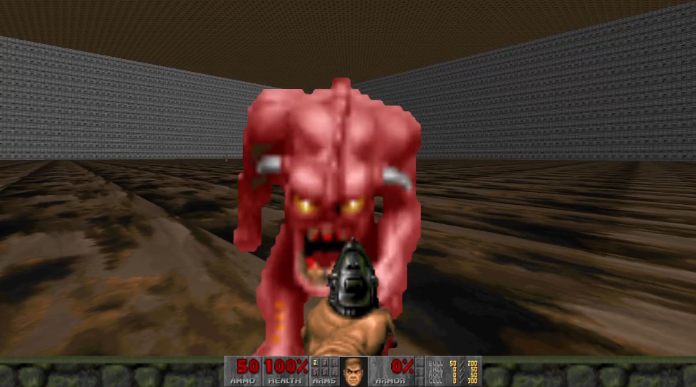
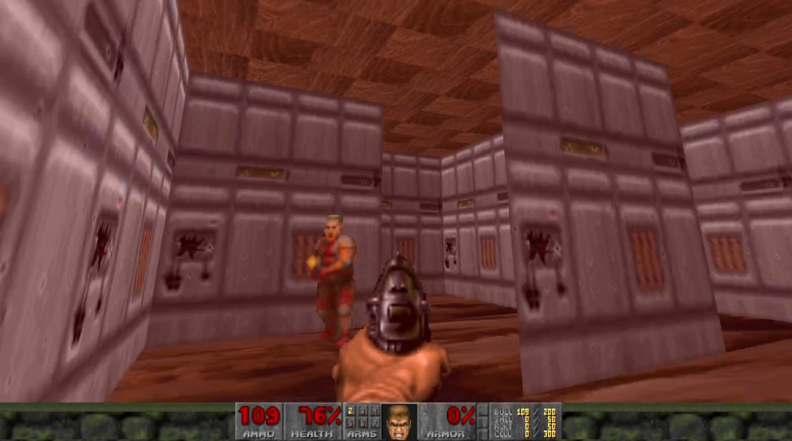
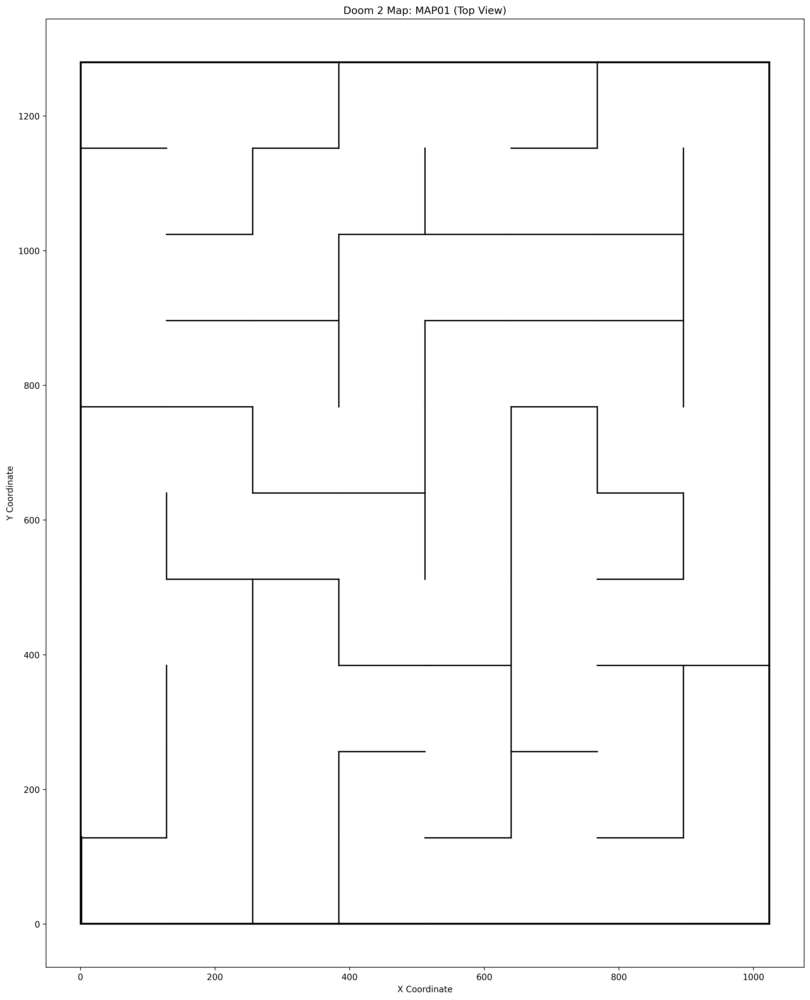

# Minotaur
Создание лабиринта для Doom2

## Intro
25 лет назад у меня была мысль - почему бы не сделать автоматическую генерацию лабиринтов для Doom2?

Где-то там эта мысль и лежала до тех пор, пока вновь не появилась в моей голове на днях.

Благо, сейчас есть ИИ, которые позволяет реализовать эти задумки с минимальным вмешательством.

Подход был следуюший:
- генерация промта для ИИ DeepSeek;
- проверка результата выполнения промта;
- ручная доводка.

На реализацию ушло около двух дней в свободное от выполнения основных задач время. Я пропущу некоторые промежуточные шаги, связанные с моим незнанием структуры файла wad и чуждым для меня python и опишу некоторые подходы и результат.

Также я опущу установку python и пакетов для него, если вы не знаете как, то ИИ в помощь.

И так, понеслась:

## 1. Генерация лабиринта

**Промт:**
```
сделать генератор лабиринтов на python.

лабиринт представляет собой двумерный массив

каждое число массива - это информация о клетке и о стенах в лабиринте, которые находятся вокруг меня, где первый бит информация о первой стене, второй бит - информация о второй стене, третий бит - информация о третьей стене.

вожно! у смежных ячеек информация о стене, которая их разделяет - одинаковая! она либо есть, либо ее нет!

должен быть сделан рандомный генератор лабиринта, заполняющий массив числами с
ограничениями:
1. у лабиринта должен быть один "вход" снаружи в левой нижней клетке и один "выход" снаружи в правой верхней клетке, все остальные внешние стены лабиринта должны быть закрыты
2. у двух смежных клеток лабиринта должны быть одинаковые стены - то есть у смежных клеток либо есть стена, либо ее нет. не должно быть так, что в одной смежной клетке информация что стена есть, а в другой, что стены нет.
3. из "входа" в "выход" должен существовать один путь, позволяющий пройти через смежные клетки в которых нет стен.

необходимо вывести лабиринт графически на экран вид сверху, где каждая стена рисуется черной палочкой
```
Все началось именно с этого, хотелось посмотреть, как будет генерироваться лабиринт. Нужно отметить, что визуально лабиринт сгенерировался правильно.

> Я потерял генерацию картинки, но мы ее восстановим на следующем шаге.

После этого я попросил переписать скрипт, который будет сохранять лабиринт в виде чисел.

Файл запускается так:
```
python lab_gen.py -o minotaur.txt -w 8 -H 10
```
где:
 -o minotaur.txt - имя файла с лабиринтом
 -w 8 - количество клеток лабиринта по высоте
 -H 10 - количество клеток лабиринта по ширине

> 8 на 10 это комфортный лабиринт, чтобы пробежать его за минуту-полторы.

```
8 10
11 6 7 3 10 2 10 22
7 5 5 9 6 9 6 5
5 5 1 10 12 3 12 13
1 12 13 3 6 1 10 6
5 3 10 12 5 1 14 5
9 12 3 6 5 13 3 4
3 10 12 5 9 10 12 5
1 10 6 9 10 10 14 5
9 6 9 6 3 10 6 5
11 8 14 9 8 14 9 12
```

> В лабиринт был заложен 5 бит - для выхода, дальше он не используется, но полезен в процессе генерации. 

## 2. Создание wad

### 2.1. Отступление
Забегая немного вперед, скажу, что запуск своей карты в doom2 осуществляется вот таким способом:

```
gzdoom.exe -iwad doom2.wad -file minotaur.wad +map MAP00
```

Подробнее будет ниже, сейчас главное уяснить следующее:
 -iwad doom2.wad - оригинальный файл с картами и ресурсами для doom2
 -file minotaur.wad - файл, который мы сгенерировали
 +map MAP00 - указание номера карты, которую нужно запустить.

И так мы создаем minotaur.wad

### 2.2. Генерация wad

Далее хотелось понять вообще реально ли создать самую простую карту для doom2, чтобы doom2 с ней запустился, без использования ранее созданного лабиринта.

```
создать скрипт на python, который создает wad файл для игры doom2 размером с футбольное поле, а ресурсы он импортирует из doom2.wad

```

Запуск генерации:

```
python football-field-sized.py
```

Запуск игры:
```
gzdoom.exe -iwad doom2.wad -file football-field.wad +map MAP00
```



> Немножко пришлось повозится со стенами в конечном скрипте, их сперва не было видно. Зато уже сейчас можно наделать всяких монстров!

### 2.3. Генерация wad и импорт карты

Теперь можно все объединить!
**Промт:**
```
модифицировать скрипт на python, который создает wad файл для игры doom2, чтобы карту он брал из файла, указанного в консоли.

в файле описаны ячейки лабиринта вид сверху в формате например:
8 10
7 11 2 10 10 6 11 22
9 10 12 3 6 9 6 5
3 14 3 12 1 6 5 5
9 10 12 3 12 13 9 4
3 10 2 12 3 10 10 12
1 6 13 3 12 3 10 6
5 9 6 9 6 9 14 5
5 7 9 6 9 10 6 5
9 4 7 9 6 3 12 5
11 8 8 14 9 8 10 12
где
8 10 - размер лабиринта
лабиринт представляет собой двухмерный массив
каждое число массива - это информация о клетке лабиринта в котором я стою и о стенах в лабиринте, которые находятся вокруг меня,
где первый бит информация о первой стене, второй бит - информация о второй стене, третий бит - информация о третьей стене, четвертый бит - информация о четвертой стене. 
Важно! у смежных ячеек информация о стене, которая их разделяет - одинаковая! она либо есть, либо ее нет!

нужно сделать скрипт, чтобы он добавлял стены в массивы linedefs и sidedefs анализируя и парся лабиринт из файла, указанный в консоли

```

Здесь захотелось вписать лабиринт в уже существующее футбольное поле, раз оно работало.

Не все получилось с самого начала, пришлось разбираться в устройстве wad файлов.

Также пришлось разобраться как создать выход.

Вот конечный скрипт генерации:
```
python gen2.py minotaur.wad minotaur.txt

```

И запускаем игру:
```
gzdoom.exe -iwad doom2.wad -file minotaur.wad +map MAP00

```



### 2.4. А что с лабиринтом?

На самом деле на предыдущем шаге ИИ никак не мог справиться с генерацией лабиринта и doom2 не хотел запускать wad.

Для понимания, что происходит был сделан промежуточный скрипт, который выводит в картинку лабиринт из wad файла.

```
python map_extractor.py

```



После этого стало понятно, что не так с лабиринтом и удалось его отладить.

## 3. Как все запустить?

### DOOM2 под разные платформы
- [GZDoom](https://zdoom.org/downloads) (с поддержкой модов и улучшенной графикой) (я использовал его);
- [Chocolate Doom](https://www.chocolate-doom.org/) (классический вариант, близкий к оригиналу).
- [Zandronum](https://zandronum.com/) (для мультиплеера).

### doom2.wad
Охраняется правообладателем:
- [doom2.wad](https://iddqd.ru/levels?find=Doom%202:%20Hell%20on%20Earth) (я брал тут).


### Поковырять wad файлы
Не обязательно, но если интересно:
- [Ultimate Doom Builder](https://forum.zdoom.org/viewtopic.php?t=66745) (удобный и понятный, через него я тренировался делать выход).
- [Slade 3](https://slade.mancubus.net/) (под разные платформы).

### Автозапуск

> Не забудьте скачать doom2.wad и положить в папку с кодом!!!

Делаем .bat для Windows в зависимости от того, где лежат файлы (и запускаем из консоли cmd).

Пути нужно поправить!
**run.bat**
```
python lab_gen.py -o minotaur.txt -w 8 -H 10
python gen2.py minotaur.wad minotaur.txt
#python map_extractor.py
D:\Doom2\gzdoom.exe -iwad doom2.wad -file minotaur.wad +map MAP00
```

Делаем .sh для Mac в зависимости от того, где лежат файлы (и запускаем из консоли).
**bash run.sh**
```
python3 lab_gen.py -o minotaur.txt -w 8 -H 10
python3 gen2.py minotaur.wad minotaur.txt
#python3 map_extractor.py
/Applications/GZDoom.app/Contents/MacOS/gzdoom -iwad doom2.wad -file minotaur.wad +map MAP00
```

## Outro
Что мы имеем:
- генерацию нового лабиринта при каждом запуске игры;
- враги и герой каждый раз в новом месте;
- возможность настроить нужно количество нечисти, оружия и патронов.

Ну, что iddqd, idkfa и в ад?!

